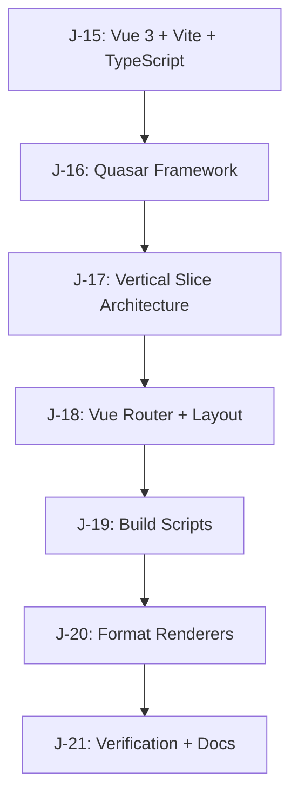

# J-11 Sub-Issues Breakdown: Vue 3 + Quasar Frontend Setup

## Overview

Linear issue J-11 has been broken down into 7 manageable sub-issues that can be worked on sequentially. Each sub-issue has clear objectives, tasks, acceptance criteria, and dependencies.

## Sub-Issues Summary

### J-15: Initialize Vue 3 Project with Vite and TypeScript
- **Estimate**: 1 story point
- **Priority**: High (4)
- **Dependencies**: None (foundation task)
- **URL**: https://linear.app/j-hernandez/issue/J-15/j-111-initialize-vue-3-project-with-vite-and-typescript

**Key Tasks**:
- Create `/frontend` directory
- Initialize Vue 3 project with Vite
- Configure TypeScript support
- Set up basic Vite configuration

**Acceptance Criteria**:
- Project initializes without errors
- TypeScript compilation works
- `npm run dev` starts development server
- Hot reload functionality works

---

### J-16: Install and Configure Quasar Framework
- **Estimate**: 1 story point
- **Priority**: High (4)
- **Dependencies**: J-15
- **URL**: https://linear.app/j-hernandez/issue/J-16/j-112-install-and-configure-quasar-framework

**Key Tasks**:
- Install Quasar Framework
- Configure Quasar plugin
- Set up Quasar configuration
- Test basic Quasar components

**Acceptance Criteria**:
- Quasar components render correctly
- No console errors related to Quasar
- Build process includes Quasar optimizations

---

### J-17: Implement Vertical Slice Architecture Structure
- **Estimate**: 2 story points
- **Priority**: High (4)
- **Dependencies**: J-16
- **URL**: https://linear.app/j-hernandez/issue/J-17/j-113-implement-vertical-slice-architecture-structure

**Key Tasks**:
- Create `/src/slices/` directory with all feature slices
- Create `/src/shared/` directory structure
- Create `/src/app/` directory with core files
- Add placeholder files and documentation

**Feature Slices**:
- `user-onboarding/`
- `team-creation/`
- `retro-facilitation/`
- `retro-participation/`
- `action-tracking/`
- `retro-export/`
- `realtime-collaboration/`

**Acceptance Criteria**:
- All directories created with proper structure
- TypeScript can resolve imports across the structure
- Architecture documentation is clear

---

### J-18: Configure Vue Router and Basic Layout Components
- **Estimate**: 2 story points
- **Priority**: High (4)
- **Dependencies**: J-17
- **URL**: https://linear.app/j-hernandez/issue/J-18/j-114-configure-vue-router-and-basic-layout-components

**Key Tasks**:
- Install and configure Vue Router 4
- Create basic route structure
- Design main layout with Quasar QLayout
- Create header/navigation components
- Set up route guards for future authentication

**Acceptance Criteria**:
- Vue Router navigates between pages correctly
- Layout components render with Quasar styling
- Responsive design works on mobile and desktop
- Error handling for invalid routes works

---

### J-19: Set up Development and Build Scripts
- **Estimate**: 1 story point
- **Priority**: High (4)
- **Dependencies**: J-18
- **URL**: https://linear.app/j-hernandez/issue/J-19/j-115-set-up-development-and-build-scripts

**Key Tasks**:
- Configure `package.json` scripts (dev, build, preview, lint, type-check)
- Set up ESLint configuration for Vue 3 + TypeScript
- Configure Prettier for code formatting
- Optimize Vite configuration
- Configure environment variables setup

**Acceptance Criteria**:
- `npm run dev` starts server on port 3000 with hot reload
- `npm run build` creates optimized production bundle
- Linting and type checking work without errors
- Build output is optimized and tree-shaken

---

### J-20: Create Format-Agnostic Renderer Foundation
- **Estimate**: 3 story points
- **Priority**: High (4)
- **Dependencies**: J-19
- **URL**: https://linear.app/j-hernandez/issue/J-20/j-116-create-format-agnostic-renderer-foundation

**Key Tasks**:
- Create base renderer interface and types
- Implement `ColumnRenderer.vue` for 4-column layouts
- Create placeholder renderers for timeline, canvas, and form formats
- Design renderer factory/registry system
- Create sample retrospective format configurations

**Renderer Components**:
- `ColumnRenderer.vue` - Traditional 4-column retrospective layout
- `TimelineRenderer.vue` - Timeline-based retrospectives
- `CanvasRenderer.vue` - Free-form canvas layouts
- `FormRenderer.vue` - Structured questionnaire formats

**Acceptance Criteria**:
- Base renderer interface is well-defined and extensible
- ColumnRenderer displays 4-column layout correctly
- Renderer factory can instantiate different format types
- Renderer switching works without errors

---

### J-21: Verify Setup and Create Documentation
- **Estimate**: 1 story point
- **Priority**: High (4)
- **Dependencies**: J-20
- **URL**: https://linear.app/j-hernandez/issue/J-21/j-117-verify-setup-and-create-documentation

**Key Tasks**:
- Verify all original J-11 acceptance criteria
- Create frontend setup documentation
- Document vertical slice architecture guidelines
- Create developer onboarding guide
- Document format renderer system
- Update main project README

**Acceptance Criteria**:
- All original J-11 acceptance criteria pass
- Documentation is comprehensive and clear
- New developers can follow setup guide successfully
- Architecture decisions are well documented

## Dependency Chain

## Total Effort Estimate

- **Total Story Points**: 11 points
- **Estimated Timeline**: 2-3 sprints (depending on team capacity)
- **Critical Path**: Sequential dependencies require completion in order

## Success Metrics

Upon completion of all sub-issues, the frontend will have:

1. ✅ Modern Vue 3 + TypeScript + Quasar foundation
2. ✅ Scalable vertical slice architecture
3. ✅ Format-agnostic retrospective renderer system
4. ✅ Production-ready build and development workflow
5. ✅ Comprehensive documentation for team onboarding

## Next Steps

1. **Start with J-15** - Initialize the Vue 3 project foundation
2. **Work sequentially** through each sub-issue following the dependency chain
3. **Review and test** each sub-issue before moving to the next
4. **Update Linear** with progress and any blockers encountered

This breakdown ensures that J-11 can be completed systematically with clear milestones and deliverables at each stage.