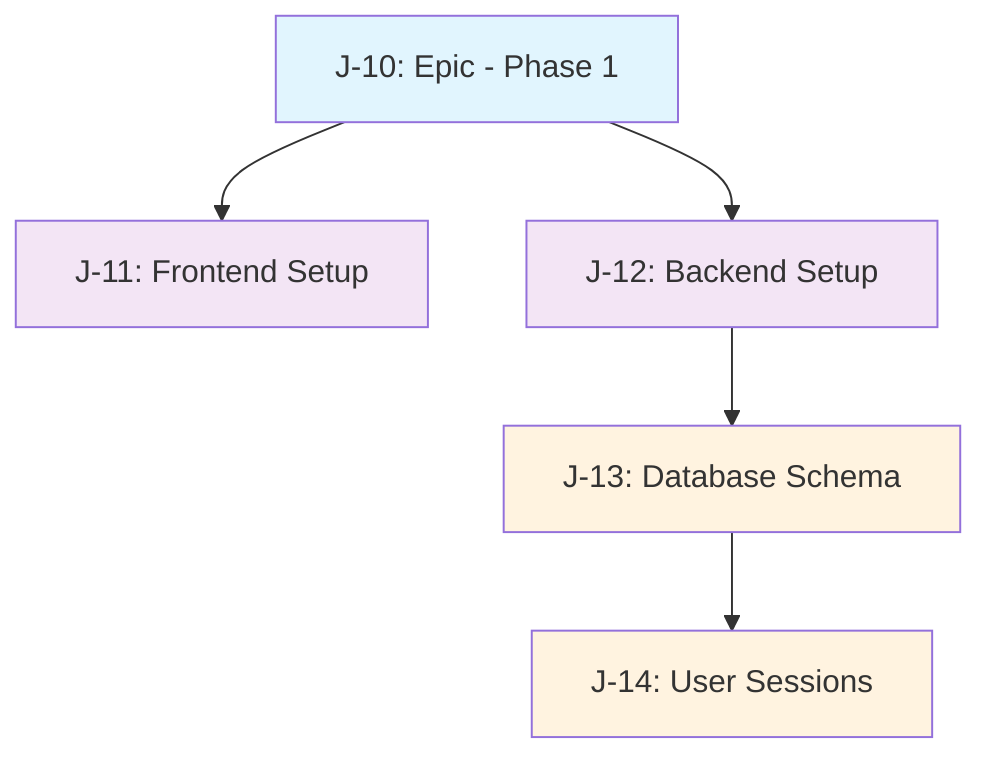

# Phase 1 Linear Issues Plan - My Retro Project

**Created**: July 14, 2025  
**Project**: My Retro - Retrospective Tool  
**Linear Project**: [My Retro Project](https://linear.app/j-hernandez/project/my-retro-project-ded216c01eb1)  
**Team**: J-Hernandez

## Overview

This document outlines the detailed plan for creating Linear issues to accomplish Phase 1: Foundation & Setup of the My Retro retrospective tool project.

## Phase 1 Scope

Phase 1 focuses on establishing the foundational infrastructure:
- Frontend project setup (Vue 3 + Quasar + TypeScript)
- Backend project setup (Node.js + Express + Socket.io + PostgreSQL)
- Database schema design and implementation
- Session-based user identification system

## Linear Project Context

- **Existing Project**: "My Retro Project" (ID: `10660cfd-8f19-48cd-b9cb-6ca38c541d91`)
- **Team**: J-Hernandez (ID: `5f5601a1-34cd-4f62-8b51-b98cc813d84b`)
- **Next Available Issue Numbers**: J-10 through J-14
- **Available Labels**: Feature, Bug, Improvement

## Proposed Linear Issues

### J-10: Epic - Phase 1: Foundation & Setup
- **Type**: Epic/Parent Issue
- **Priority**: High (4)
- **Label**: Feature
- **Project**: My Retro Project
- **Estimate**: N/A (Epic)
- **Description**:

```markdown
# Phase 1: Foundation & Setup

Establish the foundational infrastructure for the My Retro retrospective tool.

## Overview
This epic covers the initial setup of both frontend and backend infrastructure, database design, and basic user identification system.

## Phase 1 Scope
- ✅ Frontend project setup (Vue 3 + Quasar + TypeScript)
- ✅ Backend project setup (Node.js + Express + Socket.io + PostgreSQL)
- ✅ Database schema design and implementation
- ✅ Session-based user identification system

## Success Criteria
- [ ] Development environment fully functional
- [ ] Frontend and backend can communicate
- [ ] Database schema implemented and tested
- [ ] Basic user sessions working
- [ ] Ready to begin Phase 2 development

## Related Issues
- J-11: Frontend Project Setup
- J-12: Backend Infrastructure Setup  
- J-13: Database Schema Design & Implementation
- J-14: Session-Based User Identification

## Technology Stack
- **Frontend**: Vue 3 + Composition API + Quasar + TypeScript + Vite
- **Backend**: Node.js + Express + TypeScript + Socket.io
- **Database**: PostgreSQL + Prisma ORM
```

### J-11: Setup Vue 3 + Quasar Frontend Project Structure
- **Priority**: High (4)
- **Label**: Feature
- **Project**: My Retro Project
- **Estimate**: 3 points
- **Description**:

```markdown
# Frontend Project Setup

Create the frontend foundation using Vue 3, Vite, Quasar Framework, and TypeScript.

## Tasks
- [ ] Initialize Vue 3 project with Vite in `/frontend` directory
- [ ] Install and configure Quasar Framework
- [ ] Set up TypeScript configuration
- [ ] Create basic project structure and component folders
- [ ] Configure development and build scripts
- [ ] Set up basic routing with Vue Router
- [ ] Create initial layout components
- [ ] Verify hot reload and build process

## Acceptance Criteria
- [ ] `npm run dev` starts development server on port 3000
- [ ] `npm run build` creates optimized production build
- [ ] Quasar components are available and rendering
- [ ] TypeScript compilation works without errors
- [ ] Basic routing structure functional
- [ ] Hot reload works for development
- [ ] Project follows Vue 3 Composition API patterns

## File Structure Expected (True Vertical Slice Architecture)
```
frontend/
├── src/
│   ├── slices/
│   │   ├── user-onboarding/
│   │   │   ├── ui/
│   │   │   ├── business/
│   │   │   ├── data/
│   │   │   ├── types/
│   │   │   └── api/
│   │   ├── team-creation/
│   │   ├── retro-facilitation/
│   │   ├── retro-participation/
│   │   ├── action-tracking/
│   │   ├── retro-export/
│   │   └── realtime-collaboration/
│   ├── shared/
│   │   ├── ui/
│   │   ├── utils/
│   │   └── types/
│   ├── app/
│   │   ├── main.ts
│   │   ├── router.ts
│   │   └── store.ts
│   └── App.vue
├── package.json
├── vite.config.ts
└── tsconfig.json
```

## Dependencies
- Vue 3
- Quasar Framework
- Vue Router
- TypeScript
- Vite
```

### J-12: Setup Node.js Backend with Express + Socket.io + PostgreSQL
- **Priority**: High (4)
- **Label**: Feature
- **Project**: My Retro Project
- **Estimate**: 5 points
- **Description**:

```markdown
# Backend Infrastructure Setup

Create the backend foundation with Node.js, Express, Socket.io, and PostgreSQL integration.

## Tasks
- [ ] Initialize Node.js project with TypeScript in `/backend` directory
- [ ] Install and configure Express server
- [ ] Set up Socket.io for real-time communication
- [ ] Configure PostgreSQL connection
- [ ] Install and configure Prisma ORM
- [ ] Set up development scripts with hot reload (ts-node-dev)
- [ ] Create basic API structure and middleware
- [ ] Set up CORS for frontend communication
- [ ] Create health check endpoint
- [ ] Configure environment variables

## Acceptance Criteria
- [ ] Express server starts successfully on port 3001
- [ ] Socket.io connection established and testable
- [ ] PostgreSQL database connection working
- [ ] Prisma client configured and connecting
- [ ] Basic health check endpoint responds at `/api/health`
- [ ] TypeScript compilation works without errors
- [ ] Development hot reload functional
- [ ] CORS configured for frontend communication
- [ ] Environment variables properly configured

## File Structure Expected (True Vertical Slice Architecture)
```
backend/
├── src/
│   ├── slices/
│   │   ├── user-onboarding/
│   │   │   ├── api/
│   │   │   ├── business/
│   │   │   ├── data/
│   │   │   └── types/
│   │   ├── team-creation/
│   │   ├── retro-facilitation/
│   │   ├── retro-participation/
│   │   ├── action-tracking/
│   │   ├── retro-export/
│   │   └── realtime-collaboration/
│   ├── shared/
│   │   ├── middleware/
│   │   ├── utils/
│   │   └── types/
│   ├── app/
│   │   └── server.ts
│   └── types/
├── prisma/
│   └── schema.prisma
├── package.json
├── tsconfig.json
└── .env.example
```

## Dependencies
- Express.js
- Socket.io
- Prisma + @prisma/client
- PostgreSQL driver
- TypeScript + ts-node-dev
- CORS middleware
```

### J-13: Design and Implement Database Schema
- **Priority**: High (4)
- **Label**: Feature
- **Project**: My Retro Project
- **Estimate**: 5 points
- **Description**:

```markdown
# Database Schema Design & Implementation

Design and implement the complete database schema for the retrospective tool using Prisma ORM.

## Schema Requirements

### Core Tables
- **Teams**: Team management and settings
- **Users**: Session-based user identification
- **RetroSessions**: Retrospective session management
- **RetroItems**: Individual retrospective items/cards
- **Votes**: Voting system for items
- **ActionItems**: Follow-up actions from retros

## Tasks
- [ ] Create comprehensive Prisma schema file with ultra-flexible data model
- [ ] Define all tables supporting any retrospective format (not just columns)
- [ ] Set up foreign key relationships and constraints
- [ ] Create RetroFormat seed data for common formats (4-column, timeline, canvas)
- [ ] Create database migration files
- [ ] Generate Prisma client
- [ ] Create seed data for development/testing
- [ ] Test all CRUD operations across different retro formats
- [ ] Document schema relationships and format flexibility

## Acceptance Criteria
- [ ] All tables created successfully via migration
- [ ] Foreign key relationships work correctly
- [ ] Prisma client generates without errors
- [ ] Basic CRUD operations functional for all models
- [ ] Seed data populates correctly
- [ ] Schema supports any retrospective format (columns, timeline, canvas, forms)
- [ ] Ultra-flexible position_data and metadata JSON fields working
- [ ] RetroFormat system allows easy addition of new formats
- [ ] Database indexes optimized for common queries

## Schema Structure (Ultra-Flexible for Any Retro Format)
```prisma
// Ultra-flexible retro format definition
model RetroFormat {
  id                String   @id @default(cuid())
  name              String
  slug              String   @unique
  description       String?
  layoutConfig      Json     // How items are arranged/displayed
  interactionConfig Json     // What users can do (vote, drag, etc.)
  validationRules   Json     @default("{}")
  createdAt         DateTime @default(now())
  updatedAt         DateTime @updatedAt
  
  sessions RetroSession[]
}

model Team {
  id        String   @id @default(cuid())
  name      String
  createdAt DateTime @default(now())
  
  users    User[]
  sessions RetroSession[]
}

model User {
  id          String  @id @default(cuid())
  sessionId   String  @unique
  displayName String?
  teamId      String?
  createdAt   DateTime @default(now())
  
  team        Team?        @relation(fields: [teamId], references: [id])
  retroItems  RetroItem[]
  votes       Vote[]
  actionItems ActionItem[]
}

model RetroSession {
  id           String      @id @default(cuid())
  teamId       String
  facilitatorId String?
  formatId     String
  title        String
  phase        String      @default("collection") // collection, discussion, voting, actions
  status       String      @default("active")     // active, completed, archived
  createdAt    DateTime    @default(now())
  updatedAt    DateTime    @updatedAt
  
  team         Team         @relation(fields: [teamId], references: [id])
  format       RetroFormat  @relation(fields: [formatId], references: [id])
  items        RetroItem[]
  actionItems  ActionItem[]
}

// Flexible retro items (not tied to columns)
model RetroItem {
  id           String   @id @default(cuid())
  sessionId    String
  authorId     String
  content      String
  itemType     String?  // Optional categorization
  positionData Json     @default("{}") // x,y coords, column_id, timeline_position, etc.
  metadata     Json     @default("{}") // Format-specific data
  createdAt    DateTime @default(now())
  updatedAt    DateTime @updatedAt
  
  session RetroSession @relation(fields: [sessionId], references: [id])
  author  User         @relation(fields: [authorId], references: [id])
  votes   Vote[]
}

model Vote {
  id        String   @id @default(cuid())
  itemId    String
  userId    String
  createdAt DateTime @default(now())
  
  item RetroItem @relation(fields: [itemId], references: [id])
  user User      @relation(fields: [userId], references: [id])
  
  @@unique([itemId, userId])
}

model ActionItem {
  id          String    @id @default(cuid())
  sessionId   String
  content     String
  assigneeId  String?
  status      String    @default("open") // open, in_progress, completed
  dueDate     DateTime?
  createdAt   DateTime  @default(now())
  updatedAt   DateTime  @updatedAt
  
  session  RetroSession @relation(fields: [sessionId], references: [id])
  assignee User?        @relation(fields: [assigneeId], references: [id])
}
```

## Dependencies
- Requires J-12 (Backend setup) to be completed
- PostgreSQL database running
```

### J-14: Implement Session-Based User Identification System
- **Priority**: Medium (3)
- **Label**: Feature
- **Project**: My Retro Project
- **Estimate**: 3 points
- **Description**:

```markdown
# Session-Based User Identification

Implement a simple session-based user identification system without traditional authentication.

## Requirements
- Generate unique session IDs for users automatically
- Allow users to set and update display names
- Persist user sessions across browser refreshes
- Associate users with teams
- Handle session cleanup for inactive users
- No login/password required

## Tasks
- [ ] Set up express-session middleware
- [ ] Create user session management API endpoints
- [ ] Implement display name functionality
- [ ] Create session persistence logic
- [ ] Add automatic session cleanup mechanism
- [ ] Test session handling across browser tabs/windows
- [ ] Create frontend session management utilities
- [ ] Add session validation middleware

## API Endpoints
- `POST /api/users/session` - Initialize/get session
- `PUT /api/users/session/name` - Update display name
- `POST /api/users/session/join-team` - Join team with session
- `DELETE /api/users/session` - Clear session

## Acceptance Criteria
- [ ] Users automatically get unique session IDs on first visit
- [ ] Display names can be set and updated via API
- [ ] Sessions persist across page refreshes
- [ ] Users can join teams using their session
- [ ] Inactive sessions cleaned up after 24 hours
- [ ] No authentication/login flow required
- [ ] Session data available in Socket.io connections
- [ ] Frontend can manage session state

## Technical Implementation
- Use express-session with memory store (development)
- Session ID generation with crypto.randomUUID()
- Session cleanup via scheduled job
- Integration with Socket.io for real-time features

## Dependencies
- Requires J-12 (Backend setup) and J-13 (Database schema)
```

## Issue Dependencies & Execution Order



## Recommended Execution Strategy

1. **Parallel Start**: J-11 (Frontend) and J-12 (Backend) can be worked on simultaneously
2. **Sequential**: J-13 (Database) requires J-12 to be completed
3. **Final**: J-14 (User Sessions) requires both J-12 and J-13

## Summary

- **Total Issues**: 5 (1 Epic + 4 Implementation)
- **Story Points**: 16 total (3 + 5 + 5 + 3)
- **Estimated Timeline**: 2-3 weeks for solo developer
- **Issue Numbers**: J-10 through J-14

## Labels and Priorities

- All issues tagged with **"Feature"** label
- Epic and core setup issues: **High Priority (4)**
- User sessions: **Medium Priority (3)**

## Technology Stack Summary

### Frontend
- Vue 3 + Composition API
- Quasar Framework
- TypeScript
- Vite (build tool)
- Vue Router

### Backend
- Node.js + TypeScript
- Express.js
- Socket.io
- Prisma ORM
- PostgreSQL

### Development Tools
- Hot reload for both frontend and backend
- TypeScript compilation
- Environment variable management
- CORS configuration

## Next Steps

1. Review and approve this plan
2. Create all 5 issues in Linear "My Retro Project"
3. Begin implementation starting with J-11 and J-12 in parallel
4. Update issue status as work progresses
5. Move to Phase 2 planning once Phase 1 is complete

---

*This document serves as the definitive plan for Phase 1 Linear issue creation and should be referenced throughout the implementation process.*