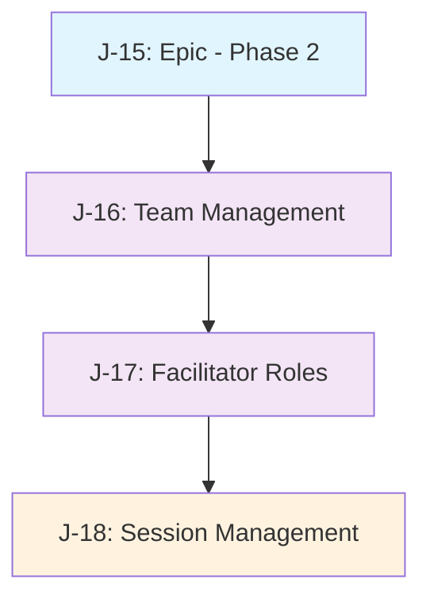

# Phase 2 Linear Issues Plan - My Retro Project

**Created**: July 16, 2025  
**Project**: My Retro - Retrospective Tool  
**Linear Project**: [My Retro Project](https://linear.app/j-hernandez/project/my-retro-project-ded216c01eb1)  
**Team**: J-Hernandez

## Overview

This document outlines the detailed plan for creating Linear issues to accomplish Phase 2: Core Team & Session Management of the My Retro retrospective tool project.

## Phase 2 Scope

Phase 2 focuses on implementing team and session management functionality:
- Team creation and joining functionality
- Facilitator role and permissions system
- Retro session management (create, schedule, join)

## Linear Project Context

- **Existing Project**: "My Retro Project" (ID: `10660cfd-8f19-48cd-b9cb-6ca38c541d91`)
- **Team**: J-Hernandez (ID: `5f5601a1-34cd-4f62-8b51-b98cc813d84b`)
- **Next Available Issue Numbers**: J-15 through J-19
- **Available Labels**: Feature, Bug, Improvement

## Proposed Linear Issues

### J-15: Epic - Phase 2: Core Team & Session Management
- **Type**: Epic/Parent Issue
- **Priority**: High (4)
- **Label**: Feature
- **Project**: My Retro Project
- **Estimate**: N/A (Epic)
- **Description**:

```markdown
# Phase 2: Core Team & Session Management

Implement team and session management infrastructure for the My Retro retrospective tool.

## Overview
This epic covers the implementation of team creation/joining functionality, facilitator roles and permissions, and retro session management.

## Phase 2 Scope
- [ ] Team management functionality (create/join teams)
- [ ] Facilitator role and permissions system
- [ ] Retro session management (create, schedule, join sessions)

## Success Criteria
- [ ] Users can create and join teams
- [ ] Teams have facilitators with special permissions
- [ ] Facilitators can create and manage retro sessions
- [ ] Users can join active retro sessions
- [ ] Ready to begin Phase 3 enhancements

## Related Issues
- J-16: Team Management Implementation
- J-17: Facilitator Role & Permissions System  
- J-18: Retro Session Management

## Technology Stack
- **Frontend**: Vue 3 + Composition API + Quasar + TypeScript + Vite
- **Backend**: Node.js + Express + TypeScript + Socket.io
- **Database**: PostgreSQL + Prisma ORM
```

### J-16: Implement Team Management Functionality
- **Priority**: High (4)
- **Label**: Feature
- **Project**: My Retro Project
- **Estimate**: 5 points
- **Description**:

```markdown
# Team Management Implementation

Create functionality for users to create and join teams within the retro tool.

## Tasks
- [ ] Create `team-management` feature slice in frontend
- [ ] Define `Team` and `TeamMember` models in Prisma schema
- [ ] Create database migrations for team tables
- [ ] Implement backend API endpoints:
  - `POST /api/teams` - Create a new team
  - `POST /api/teams/:teamId/join` - Join team with invite code
  - `GET /api/teams` - List user's teams
- [ ] Create `CreateTeamView.vue` component with team creation form
- [ ] Create `JoinTeamView.vue` component for entering invite codes
- [ ] Create `TeamListView.vue` to display user's teams
- [ ] Add team switching functionality
- [ ] Implement invite code generation and validation
- [ ] Add unit tests using Vitest
- [ ] Add end-to-end tests using Playwright

## Acceptance Criteria
- [ ] Users can create new teams with custom names
- [ ] Team creator automatically becomes facilitator
- [ ] Teams generate unique invite codes for joining
- [ ] Users can join teams via invite codes
- [ ] Users can view and switch between their teams
- [ ] Team data persists and loads correctly
- [ ] Invite codes are validated properly
- [ ] Unit tests pass for all functionality
- [ ] End-to-end tests verify team creation and joining flows

## Frontend Components Expected
```
frontend/
├── src/
│   ├── slices/
│   │   ├── team-management/
│   │   │   ├── ui/
│   │   │   │   ├── CreateTeamView.vue
│   │   │   │   ├── JoinTeamView.vue
│   │   │   │   └── TeamListView.vue
│   │   │   ├── business/
│   │   │   │   └── teamService.ts
│   │   │   ├── data/
│   │   │   │   └── teamRepository.ts
│   │   │   ├── types/
│   │   │   │   └── index.ts
│   │   │   └── api/
│   │   │       └── teamApi.ts
```

## Backend Implementation Expected
```
backend/
├── src/
│   ├── slices/
│   │   ├── team-management/
│   │   │   ├── api/
│   │   │   │   └── teamController.ts
│   │   │   ├── business/
│   │   │   │   └── teamService.ts
│   │   │   ├── data/
│   │   │   │   └── teamRepository.ts
│   │   │   └── types/
│   │   │       └── index.ts
│   ├── shared/
│   │   └── utils/
│   │       └── inviteCodeGenerator.ts
```

## Dependencies
- Requires Phase 1 completion (J-10 through J-14)
- Database schema updates for Team model
```

### J-17: Implement Facilitator Role and Permissions System
- **Priority**: High (4)
- **Label**: Feature
- **Project**: My Retro Project
- **Estimate**: 3 points
- **Description**:

```markdown
# Facilitator Role & Permissions System

Implement a role-based permissions system with facilitator capabilities for team retrospectives.

## Tasks
- [ ] Add `role` field to `TeamMember` model (facilitator/participant)
- [ ] Create middleware to protect facilitator-only routes
- [ ] Implement automatic facilitator assignment for team creators
- [ ] Create facilitator permission checks on frontend
- [ ] Update UI to conditionally render controls based on user role
- [ ] Display member roles in team view
- [ ] Implement facilitator transfer functionality
- [ ] Add unit tests for permission checking
- [ ] Add end-to-end tests for role-based UI differences

## Acceptance Criteria
- [ ] Team creator automatically receives facilitator role
- [ ] API endpoints properly protect facilitator-only actions
- [ ] UI conditionally renders controls based on user role
- [ ] Only facilitators can see session creation controls
- [ ] Only facilitators can change session phases
- [ ] User roles are clearly displayed in the UI
- [ ] Facilitators can transfer their role to other team members
- [ ] Unit tests verify permission checks
- [ ] End-to-end tests confirm role-based access controls

## Implementation Details
- Add `role` enum field to TeamMember model
- Create `requireFacilitator` middleware for backend routes
- Use Composition API to create `useFacilitatorPermissions` composable
- Create role indicators in UI

## Backend Implementation Expected
```
backend/
├── src/
│   ├── slices/
│   │   ├── team-management/
│   │   │   ├── api/
│   │   │   │   └── roleController.ts
│   │   │   ├── business/
│   │   │   │   └── roleService.ts
│   │   │   └── types/
│   │   │       └── Role.ts
│   ├── shared/
│   │   └── middleware/
│   │       └── requireFacilitator.ts
```

## Dependencies
- Requires J-16 (Team Management)
- Database schema updates for role field
```

### J-18: Create Retro Session Management
- **Priority**: High (4)
- **Label**: Feature
- **Project**: My Retro Project
- **Estimate**: 5 points
- **Description**:

```markdown
# Retro Session Management

Implement functionality to create, schedule, and join retrospective sessions.

## Tasks
- [ ] Create `session-management` feature slice in frontend
- [ ] Define `RetroSession` model in Prisma schema
- [ ] Create database migrations for session tables
- [ ] Implement backend API endpoints:
  - `POST /api/sessions` - Create a new session (facilitator only)
  - `PUT /api/sessions/:sessionId` - Update session status
  - `GET /api/teams/:teamId/sessions` - List team sessions
- [ ] Create `CreateSessionModal.vue` component for session creation
- [ ] Update team dashboard to list all sessions with status
- [ ] Add "Join" functionality for active sessions
- [ ] Implement session status management (pending/active/completed)
- [ ] Create session scheduling capability
- [ ] Add unit tests using Vitest
- [ ] Add end-to-end tests using Playwright

## Acceptance Criteria
- [ ] Facilitators can create new retro sessions with titles and dates
- [ ] Sessions display their current status (pending/active/completed)
- [ ] Facilitators can change session status
- [ ] Team dashboard displays all sessions for the team
- [ ] Users can join active sessions via "Join" button
- [ ] Sessions can be scheduled for future dates
- [ ] Unit tests pass for all functionality
- [ ] End-to-end tests verify session creation and joining flows

## Frontend Components Expected
```
frontend/
├── src/
│   ├── slices/
│   │   ├── session-management/
│   │   │   ├── ui/
│   │   │   │   ├── CreateSessionModal.vue
│   │   │   │   ├── SessionList.vue
│   │   │   │   └── SessionCard.vue
│   │   │   ├── business/
│   │   │   │   └── sessionService.ts
│   │   │   ├── data/
│   │   │   │   └── sessionRepository.ts
│   │   │   ├── types/
│   │   │   │   └── index.ts
│   │   │   └── api/
│   │   │       └── sessionApi.ts
```

## Backend Implementation Expected
```
backend/
├── src/
│   ├── slices/
│   │   ├── session-management/
│   │   │   ├── api/
│   │   │   │   └── sessionController.ts
│   │   │   ├── business/
│   │   │   │   └── sessionService.ts
│   │   │   ├── data/
│   │   │   │   └── sessionRepository.ts
│   │   │   └── types/
│   │   │       └── index.ts
```

## Dependencies
- Requires J-16 (Team Management) and J-17 (Facilitator Roles)
- Database schema updates for RetroSession model
```

## Issue Dependencies & Execution Order



## Recommended Execution Strategy

1. **Sequential Start**: Begin with J-16 (Team Management) implementation
2. **Dependent**: J-17 (Facilitator Roles) requires J-16 to be completed
3. **Final**: J-18 (Session Management) requires both J-16 and J-17

## Summary

- **Total Issues**: 4 (1 Epic + 3 Implementation)
- **Story Points**: 13 total (5 + 3 + 5)
- **Estimated Timeline**: 2 weeks for solo developer
- **Issue Numbers**: J-15 through J-18

## Labels and Priorities

- All issues tagged with **"Feature"** label
- All implementation issues: **High Priority (4)**

## Technology Stack Summary

### Frontend
- Vue 3 + Composition API
- Quasar Framework
- TypeScript
- Vite (build tool)
- Vitest (unit testing)
- Playwright (end-to-end testing)

### Backend
- Node.js + TypeScript
- Express.js
- Prisma ORM
- PostgreSQL

## Testing Strategy

- **Unit Tests**: Implement with Vitest for both frontend and backend
- **End-to-End Tests**: Use Playwright for critical user flows:
  - Team creation
  - Team joining with invite code
  - Facilitator permissions
  - Session creation and management

## Next Steps

1. Review and approve this plan
2. Create all 4 issues in Linear "My Retro Project"
3. Begin implementation with J-16 (Team Management)
4. Update issue status as work progresses
5. Move to Phase 3 planning once Phase 2 is complete

---

*This document serves as the definitive plan for Phase 2 Linear issue creation and should be referenced throughout the implementation process.*
