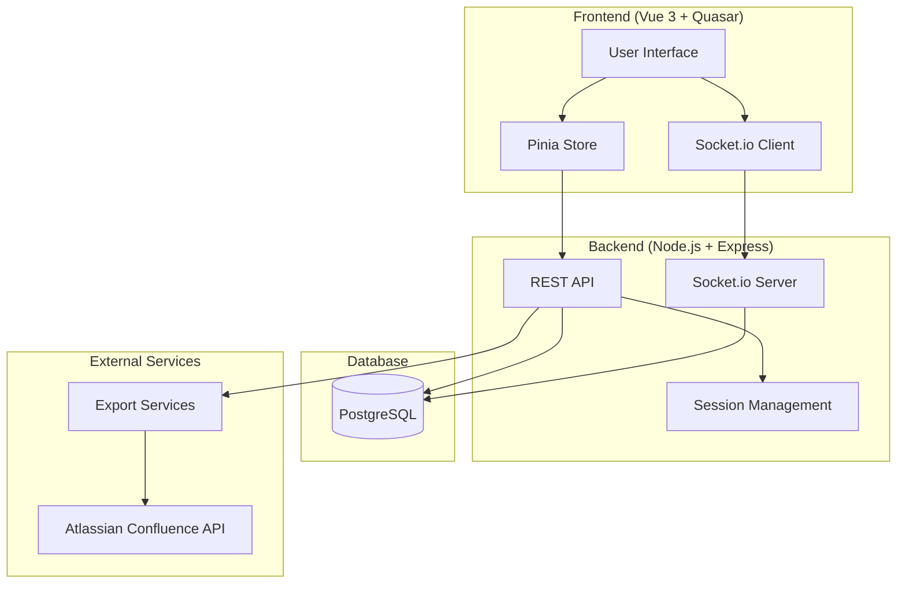
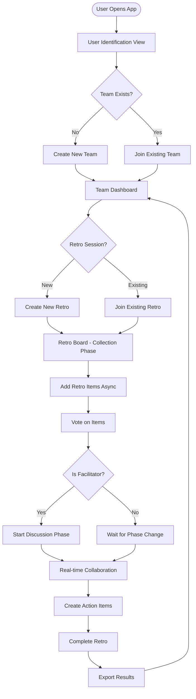
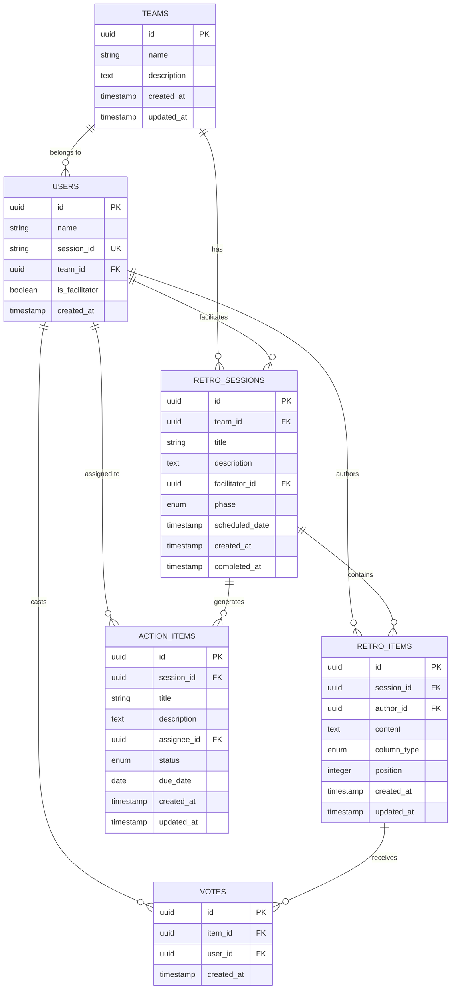
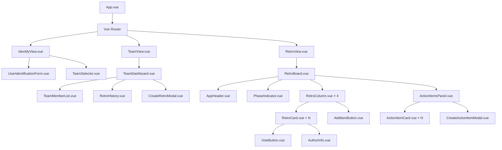
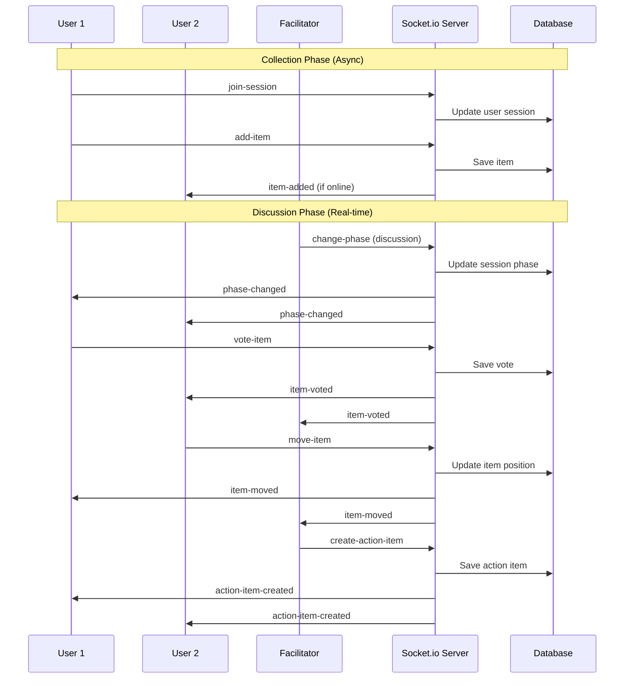
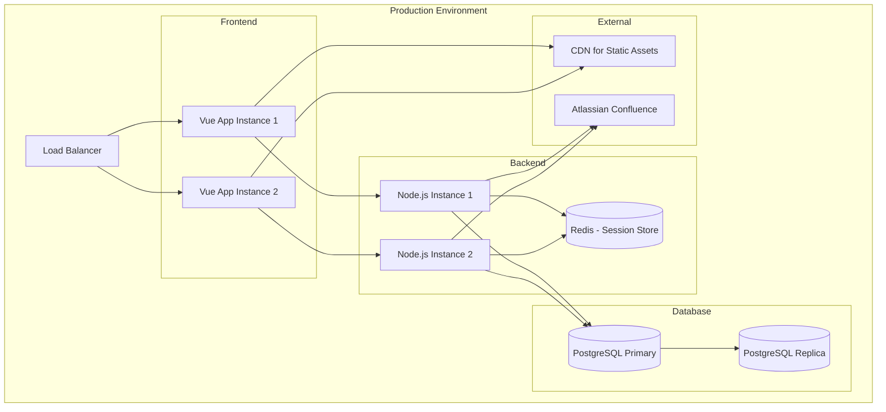

# System Architecture Diagrams

## High-Level System Architecture



## User Flow Diagram



## Database Entity Relationship Diagram



## Component Hierarchy



## Real-time Communication Flow



## API Endpoints Structure

### REST API Endpoints

```
Authentication & Session Management:
POST   /api/auth/identify          - Create user session
GET    /api/auth/session           - Get current session
DELETE /api/auth/session           - End session

Teams:
GET    /api/teams                  - List user's teams
POST   /api/teams                  - Create new team
GET    /api/teams/:id              - Get team details
PUT    /api/teams/:id              - Update team
DELETE /api/teams/:id              - Delete team
POST   /api/teams/:id/join         - Join existing team

Retro Sessions:
GET    /api/teams/:teamId/retros   - List team's retros
POST   /api/teams/:teamId/retros   - Create new retro
GET    /api/retros/:id             - Get retro details
PUT    /api/retros/:id             - Update retro
DELETE /api/retros/:id             - Delete retro
POST   /api/retros/:id/join        - Join retro session

Retro Items:
GET    /api/retros/:id/items       - Get retro items
POST   /api/retros/:id/items       - Create retro item
PUT    /api/items/:id              - Update retro item
DELETE /api/items/:id              - Delete retro item
POST   /api/items/:id/move         - Move item between columns

Voting:
POST   /api/items/:id/vote         - Toggle vote on item
GET    /api/items/:id/votes        - Get item votes

Action Items:
GET    /api/retros/:id/actions     - Get action items
POST   /api/retros/:id/actions     - Create action item
PUT    /api/actions/:id            - Update action item
DELETE /api/actions/:id            - Delete action item

Export:
GET    /api/retros/:id/export      - Export retro (markdown/json/csv)
POST   /api/retros/:id/confluence  - Export to Confluence
```

### Socket.io Events

```
Connection Events:
- connect
- disconnect
- join-session
- leave-session

Retro Item Events:
- item-added
- item-updated
- item-deleted
- item-moved
- item-voted

Session Management Events:
- phase-changed
- user-joined
- user-left
- facilitator-changed

Action Item Events:
- action-item-created
- action-item-updated
- action-item-deleted

Error Events:
- error
- validation-error
- permission-error
```

## Deployment Architecture



## Security Considerations

### Frontend Security:
- Input sanitization for all user inputs
- XSS prevention with Vue's built-in protections
- CSRF protection for API calls
- Content Security Policy (CSP) headers

### Backend Security:
- Rate limiting on all endpoints
- Input validation and sanitization
- SQL injection prevention with parameterized queries
- Session security with secure cookies
- CORS configuration for frontend domains

### Database Security:
- Connection encryption (SSL/TLS)
- Regular backups with encryption
- Access control with least privilege principle
- Database connection pooling with limits

### Socket.io Security:
- Room-based access control
- Event validation and sanitization
- Connection rate limiting
- Authentication verification for all events

---

*This comprehensive architecture provides a solid foundation for building a scalable, secure, and maintainable retrospective tool that meets all the specified requirements.*